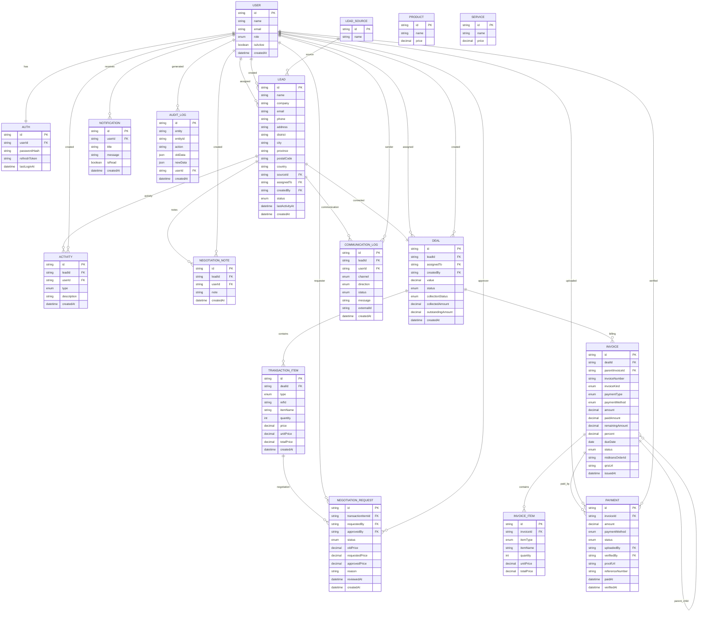

# DATABASE DESIGN

## FECRM Database Architecture

FECRM menggunakan PostgreSQL sebagai database utama dan Prisma ORM sebagai data access layer.

Database dirancang menggunakan pendekatan:

* Relational Database Design
* Normalized Structure (3NF)
* Audit Trail Support
* Soft Delete Support
* Role-Based Access Control
* Invoice Hierarchy System
* Negotiation Approval Workflow


# Database Statistics

| Category             | Count |
| -------------------- | ----- |
| Enum                 | 13    |
| Main Entity          | 17    |
| Core Business Module | 8     |
| User Role            | 5     |


# Entity Relationship Diagram (ERD)




# Core Business Relationship

## Lead Lifecycle

```text
Lead Source
    ↓
Lead
    ↓
Activity
    ↓
Communication
    ↓
Negotiation
    ↓
Deal
```


## Sales Lifecycle

```text
Deal
    ↓
Transaction Item
    ↓
Negotiation Request
    ↓
Manager Approval
    ↓
Invoice Generation
```


## Finance Lifecycle

```text
Invoice
    ↓
Payment
    ↓
Verification
    ↓
Collection Update
    ↓
Deal Collection Status
```


## Invoice Hierarchy

```text
MASTER INVOICE

├── TERMIN 1
├── TERMIN 2
└── TERMIN 3
```

Relasi ini menggunakan:

```text
Invoice.parentInvoiceId
```

Sehingga satu Master Invoice dapat memiliki banyak Termin Invoice.


# Database Design Principles

## Soft Delete

Entity yang mendukung soft delete:

* User
* Lead
* Deal
* Invoice

Menggunakan:

```text
deletedAt
```


## Auditability

Seluruh perubahan penting dicatat pada:

```text
AuditLog
```

Contoh:

* Create Lead
* Assign Lead
* Create Deal
* Approve Negotiation
* Create Invoice
* Verify Payment


## Scalability

Database dirancang agar mampu menangani:

* Ribuan Lead
* Ribuan Deal
* Ribuan Invoice
* Multi Sales Team
* Multi Finance Team
* Multi Negotiation Workflow


# Database Version

Current Schema Version:

```text
FECRM v1.0
```

Database Engine:

```text
PostgreSQL
```

ORM:

```text
Prisma ORM
```

Architecture:

```text
CRM + Sales Pipeline + Finance Collection
```
